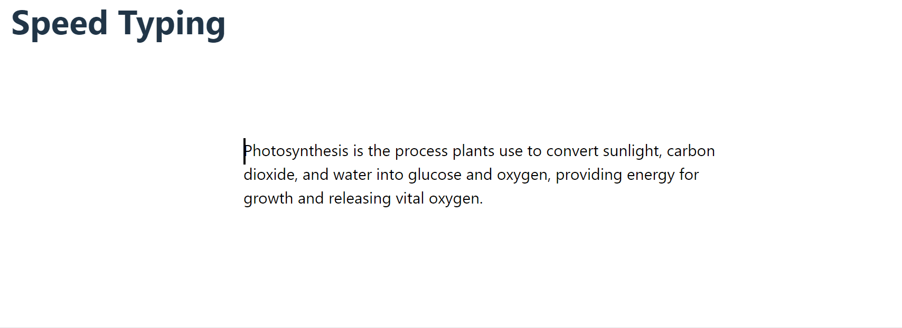

# About this project

This game was developed for education purposes only.
The game suggests a text that the player has to write as fast and accurate as possible. The player can keep track of his words per minute and his accuracy.

# Built with:

This project was developed with React + Typescript using the vite template and SCSS.

# SHOWCASE

